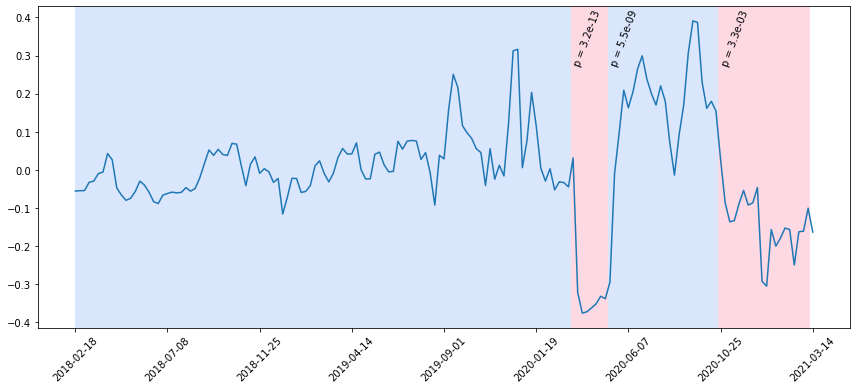

# Changing Gears: Statistical Analysis of Bike Traffic around Paris


This project was done for Laurent Oudre's [Machine Learning for Time Series](http://www.laurentoudre.fr/ast.html) class as part of the MVA course. We studied and implemented a state of the art technique for the statistical analysis of changepoints in time series, and applied it to real world data regarding bike usage around Paris.

An explanation of what we have done can be found in the project report pdf. However, it is not intented to be fully understood by readers who aren't familiar with the paper by Duy et al. [*Computing Valid p-value for Optimal Changepoint by Selective Inference using Dynamic Programming*](https://arxiv.org/abs/2002.09132) that this project is based off. We encourage readers to have a look at this paper first.

We reimplemented the method from scratch in Python (for a fixed number of changepoints K) and checked it was working by reproducing some simple performance tests from the article. We then went on to apply the method to some novel real world data.

## Bike data

We tested Duy et al.'s algorithm on two realworld datasets based around the theme of bike usage in Paris.

The first is an estimation of the number of *Velib'* (Paris' bike-sharing service) journeys made each hour. The data was collected and aggregated [here](https://velib.philibert.info/) and relies on the official Velib' API. The number of journeys is estimated by checking the number of velib at each station every 5 minutes and hence tracking which bikes moved. We noted that the data has a significant upwards trend as the service has grown more popular and more bikes were added over the years. We removed the trend before running any changepoint detection. We also decided to remove the the weekly periodic component by considering the number of journeys made each week. The algorithm detected with statistical significance changes in the city's lockdown policy.



The second dataset comes from Paris' Open Data initiative. The city has deployed a network of sensors all around the city to measure bike traffic on its cycle paths. This dataset consists of the hourly count of bikes passing by a given sensor for the last thirteen months. We arbitrarily selected the sensor from quai de Grenelle (pictured below), and, as above, we removed the periodic component by summing over each week.


$x=1$

## Running code
To run the code, we recommend creating a conda environment using
```
conda env create -f environment.yml
conda activate TimeSeries
```
